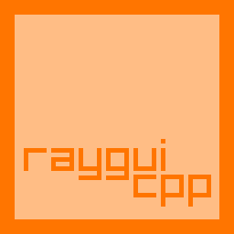

# Raygui-cpp

Raygui-cpp is a C++ wrapper for [raygui](https://github.com/raysan5/raygui) library.
Raygui was originally written in C, but this wrapper allows you to use it in C++ projects.

NOTES:

- This is a work in progress. Some functions are not yet implemented.
- To ease the integration between raylib and raygui, the `raygui.h` file has been divided in two files: `raygui.h` and
  `raygui.cpp`.
  The raygui.cpp file contains the implementation of the functions, while the `raygui.h` file contains the
  declarations.
  This is done to avoid the multiple definition of the same functions when linking the raygui library
  with raylib.

## Usage

To use raygui-cpp in your project, you need to download the source code and add it to your project.
Add the folder containing the source code to your `include` path and add the next configuration to your CMakeLists.txt
file:

```cmake
add_subdirectory(<path_to_raygui_cpp_folder>)
target_link_libraries(<your_target> raygui_cpp)
```

## Implementation todo list

- [x] Button ([header](include/raygui-cpp/Button.h), [source](src/raygui-cpp/Button.cpp))
- [x] CheckBox ([header](include/raygui-cpp/CheckBox.h), [source](src/raygui-cpp/CheckBox.cpp))
- [x] ColorBarAlpha ([header](include/raygui-cpp/ColorBarAlpha.h), [source](src/raygui-cpp/ColorBarAlpha.cpp))
- [x] ColorBarHue ([header](include/raygui-cpp/ColorBarHue.h), [source](src/raygui-cpp/ColorBarHue.cpp))
- [x] ColorPanel ([header](include/raygui-cpp/ColorPanel.h), [source](src/raygui-cpp/ColorPanel.cpp))
- [x] ColorPicker ([header](include/raygui-cpp/ColorPicker.h), [source](src/raygui-cpp/ColorPicker.cpp))
- [x] ComboBox ([header](include/raygui-cpp/ComboBox.h), [source](src/raygui-cpp/ComboBox.cpp))
- [x] DropdownBox ([header](include/raygui-cpp/DropdownBox.h), [source](src/raygui-cpp/DropdownBox.cpp))
- [x] DummyRec ([header](include/raygui-cpp/DummyRec.h), [source](src/raygui-cpp/DummyRec.cpp))
- [x] Globals ([header](include/raygui-cpp/Globals.h), [source](src/raygui-cpp/Globals.cpp))
- [x] Grid ([header](include/raygui-cpp/Grid.h), [source](src/raygui-cpp/Grid.cpp))
- [x] GroupBox ([header](include/raygui-cpp/GroupBox.h), [source](src/raygui-cpp/GroupBox.cpp))
- [x] Label ([header](include/raygui-cpp/Label.h), [source](src/raygui-cpp/Label.cpp))
- [x] LabelButton ([header](include/raygui-cpp/LabelButton.h), [source](src/raygui-cpp/LabelButton.cpp))
- [x] Line ([header](include/raygui-cpp/Line.h), [source](src/raygui-cpp/Line.cpp))
- [x] ListView ([header](include/raygui-cpp/ListView.h), [source](src/raygui-cpp/ListView.cpp))
- [x] ListViewEx ([header](include/raygui-cpp/ListViewEx.h), [source](src/raygui-cpp/ListViewEx.cpp))
- [x] MessageBox ([header](include/raygui-cpp/MessageBox.h), [source](src/raygui-cpp/MessageBox.cpp))
- [x] Panel ([header](include/raygui-cpp/Panel.h), [source](src/raygui-cpp/Panel.cpp))
- [x] ProgressBar ([header](include/raygui-cpp/ProgressBar.h), [source](src/raygui-cpp/ProgressBar.cpp))
- [x] ScrollPanel ([header](include/raygui-cpp/ScrollPanel.h), [source](src/raygui-cpp/ScrollPanel.cpp))
- [x] Slider ([header](include/raygui-cpp/Slider.h), [source](src/raygui-cpp/Slider.cpp))
- [x] SliderBar ([header](include/raygui-cpp/SliderBar.h), [source](src/raygui-cpp/SliderBar.cpp))
- [x] Spinner ([header](include/raygui-cpp/Spinner.h), [source](src/raygui-cpp/Spinner.cpp))
- [x] StatusBar ([header](include/raygui-cpp/StatusBar.h), [source](src/raygui-cpp/StatusBar.cpp))
- [x] TabBar ([header](include/raygui-cpp/TabBar.h), [source](src/raygui-cpp/TabBar.cpp))
- [x] TextBox ([header](include/raygui-cpp/TextBox.h), [source](src/raygui-cpp/TextBox.cpp))
- [x] TextInputBox ([header](include/raygui-cpp/TextInputBox.h), [source](src/raygui-cpp/TextInputBox.cpp))
- [x] Toggle ([header](include/raygui-cpp/Toggle.h), [source](src/raygui-cpp/Toggle.cpp))
- [x] ToggleGroup ([header](include/raygui-cpp/ToggleGroup.h), [source](src/raygui-cpp/ToggleGroup.cpp))
- [x] ValueBox ([header](include/raygui-cpp/ValueBox.h), [source](src/raygui-cpp/ValueBox.cpp))
- [x] WindowBox ([header](include/raygui-cpp/WindowBox.h), [source](src/raygui-cpp/WindowBox.cpp))

## More info

For more information about raygui, visit the [official raygui repository](https://github.com/raysan5/raygui).

## License

Raygui-cpp is licensed under zlib/libpng license, same as raygui. See [LICENSE.txt](LICENSE.txt) for more information.

## Author

Raygui-cpp is developed by:

- [Samuel Castrillo](https://github.com/scastd)
